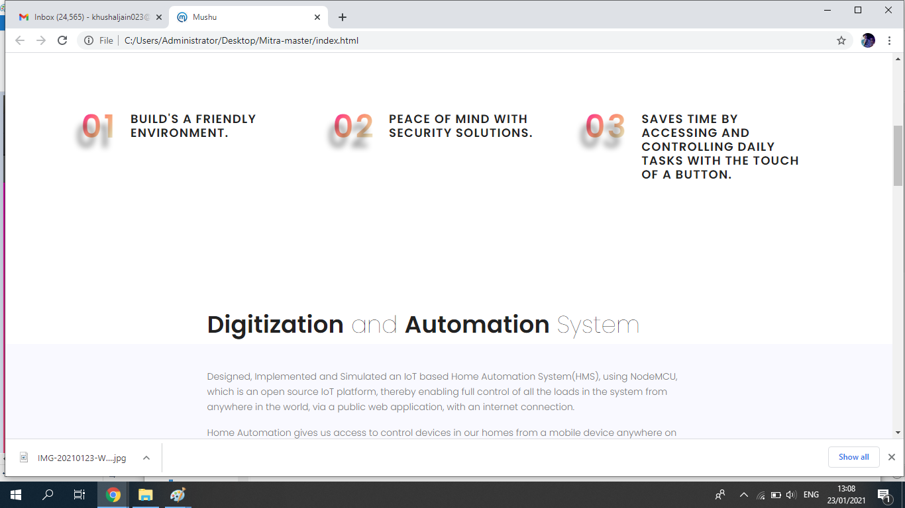
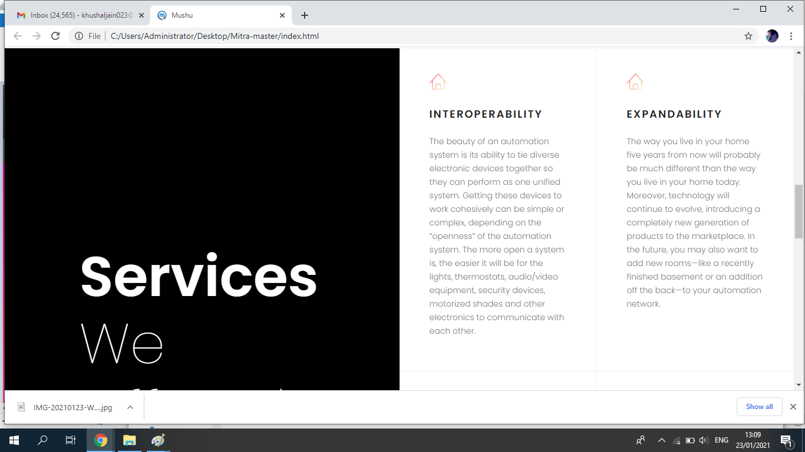

# Mushugithub.io


Designed, Implemented and Simulated an IoT based Home Automation System(HMS), using NodeMCU, which is an open source IoT platform, thereby enabling full control of all the loads in the system from anywhere in the world, via a public web application, with an internet connection.

 Web-Link : https://85599.github.io/Mushugithub.io/

## SCREENSHOTS :

```diff
+ HOME PAGE :

```

 


```diff
+ SECOND PAGE :

```

 

```diff
+ THIRD PAGE :

```

 

```diff
+ FOURTH PAGE :

```


